<div align="center">

<picture>
  <source media="(prefers-color-scheme: dark)" srcset="header.svg">
  <source media="(prefers-color-scheme: light)" srcset="header_light.svg">
  
</picture>

<br/>

[](https://github.com/EsmaeelNabil)

</div>

<br/>

```text
~/portfolio  main  ❯  cat about.md
```

I'm a software engineer focused on **mobile development** and **security** —  
readable code first, clever code second, and something new learned every day.

**Currently:** Building at [@woltapp](https://github.com/woltapp)  
**2026:** Deepening open source contributions  
**Always:** Open to interesting problems and collaboration

<br/>

```text
~/portfolio  main  ❯  ls -la interests/
```

```
drwxr-xr-x   Mobile Development (Android · Kotlin · Jetpack)
drwxr-xr-x   Security Research
drwxr-xr-x   Open Source
-rw-r--r--   Night walks 🌙
-rw-r--r--   Music 🎵
```

<br/>

---

<div align="center">

[GitHub](https://github.com/EsmaeelNabil) · [LinkedIn](https://linkedin.com/in/esmaeel-moustafa-1813649b)

</div>
